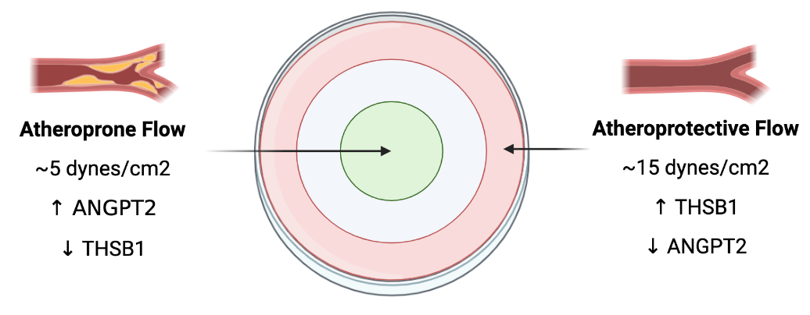

```{r setup, include=FALSE}
knitr::opts_chunk$set(echo = FALSE, message = FALSE, warning = FALSE, fig.align= "center")
```

```{r load-pkgs}
library(tidyverse) # Load the tidyverse. Functions are used for tidying data and creating plots via ggplot2.

library(kableExtra) # Load kableExtra. Table generation.

library(wordcountaddin) # Load wordcountaddin. Counts words and characters in text in an R markdown document.
```

```{r source}
 source("../R/final.R", local = knitr::knit_global())
```

# Introduction

Atherosclerosis is a chronic inflammatory disease characterised by the formation of arterial plaques.
Haemodynamic shear stress has been identified as a modulator of site-specificity in atherosclerosis, which occurs preferentially in regions exposed to low, oscillatory shear stress [@stone2007]. Whereas areas of high, laminar shear stress are atheroprotective [@timmins2017]. Shear stress is an important factor in regulating gene expression in vascular endothelial cells [@Ni2010], which is thought to contribute to the susceptibility of plaque formation in atheroprone sites. Multiple omics studies have implicated variations in flow with the regulation of developmental signalling pathways in atherosclerosis, including the Wnt Pathway [@Souilhol2020; @Gelfand2011].

Wnt is an evolutionarily conserved pathway with a critical role in axis patterning during embryonic development.
In the absence of Wnt, axin forms a destruction complex with glycogen synthase kinase 3β (GSK-3) and adenomatous polyposis coli (APC), which phosphorylates β-catenin and targets it for degradation.
However, in the active canonical Wnt pathway, Wnt ligands interact with Frizzled and LRP receptors.
This leads to the translocation of axin, inhibiting the formation of the destruction complex, allowing β-catenin to accumulate and translocate to the nucleus, where it will activate the transcription of Wnt target genes [@gordon2006]. Of these includes axin, which acts as a negative regulator of Wnt signalling [@Jho2002; @Lustig2002].

Shear stress-mediated Wnt orchestrates a range of endothelial responses, including angiogenesis, which is increased in regions of low shear stress compared to high shear stress [@du2018]. One target of Wnt, angiopoietin-2 (ANGPT2), is an established growth factor involved in angiogenesis. Studies in both zebrafish and mice have shown that the increase in ANGPT2 contributes to the development of atherosclerosis [@Li2014-mx; @farhat2013].

Thrombospondin-1 (THBS1) is a glycoprotein involved in endothelial cell interactions and is a potential target of Wnt.
High levels of THBS1 have been correlated with the inhibition of tumour angiogenesis [@naumov2006], possibly by induction of apoptosis via the TGF-β pathway [@Miao2001; @yee2004], or by inhibition of the VEGF pathway [@gupta1999; @kaur2010].
THBS1 deficiency has also been implicated in atherosclerosis diseased mice [@Moura2008].
However, little is known of the mechanism behind this.
@jo2005 demonstrated that activation of the Wnt pathway downregulates THBS1 in colon cancer, but it is not known whether WNT regulates THBS1 in atherosclerosis.
Thus, we analysed whether Wnt mediates the expression of THBS1 in response to flow.
Since atherosclerosis occurs in regions of increased angiogenesis, we would expect *THSB1* to be downregulated in low shear stress.

```{r orbital, out.width = "80%", fig.cap = "The orbital shaker model replicates the shear stress exterted in atheroprone and atheroprotective regions. Image created with BioRender."}

```

In our study, we aimed to compare the expression of *ANGPT2* and *THBS1* in HUVECs exposed to atheroprone low shear stress (LSS) and atheroprotective high shear stress (HSS) using an orbital shaker model.
The model, described by @Warboys2014, exposes cells to variable stress of approximately 5 dynes in the centre and approximately 15 dynes in the periphery of the plate (Figure \@ref(fig:orbital)).
The purpose of this is to replicate the forces exerted in atheroprone and atheroprotective regions, respectively.
Based on the prior work mentioned, we expect LSS to upregulate *ANGPT2* and downregulate *THSB1* when compared to HSS.
We also used an inhibitor to examine whether the altered expression of these genes is controlled by shear stress-mediated canonical Wnt signalling.

# Materials and Methods

## Cell Culture and Application of Shear Stress

HUVECs were cultured at 37°C in 8% M199, 0.15% sodium bicarbonate, 1 U/mL pen-strep, 0.1 ug/ml amphotericin B, 20% Hi-FBS, 30 ug/ml endothelial cell growth supplement (ECGS), and 10 U/ml heparin.
After reaching \~80% confluence, passage 2 cells were incubated with 1ml of trypsin until cells thoroughly detached, and neutralised with 9ml of M199.
They were then re-suspended in M199 media before transferring to 10mm radius 6 well plates coated in 1% gelatin.
The canonical Wnt pathway was inhibited using XAV939.
Once confluent, cells were treated with either 3ml of 0.1% DMSO in M199 or 0.1% XAV939 in M199 [@Zhu2017].
They were placed on an orbital shaker at 210 rpm for 72 hours, and exposed to low (\~5 dynes/cm^2^) and high shear stress (\~15 dynes/cm^2^) [@Warboys2019], with the exception of the static control.

## RNA Extraction and Real-Time Quantitative PCR

Cells were isolated from the periphery and centre of the plates with cold PBS and centrifuged for 5 minutes at 400g.
Total mRNA was extracted using the RNEasy Mini Kit (Qiagen) and the concentration was determined spectrophotometrically.
cDNA synthesis was performed using the Verso cDNA Synthesis Kit (Thermo Scientific) as per the manufacturers instructions.
*ANGPT2*, *AXIN2*, *THSB1*, and *HPRT1* (reference gene) mRNA was quantified using StepOne qPCR (Thermo Scientific) with SYBR Green, using oligonucleotide qPCR primers from Ensembl [@howe2020] (Table \@ref(tab:primers)).
The amplification included 30 cycles at 95°C for 30s, 5°C for 30s, and 72°C for 45s, followed by 72 °C 10 min.

```{r primers}
knitr::kable(
    data.frame(
        Gene = c(
            "ANGPT2",
            "ANGPT2",
            "AXIN1",
            "AXIN1",
            "HPRT1",
            "HPRT1",
            "THSB1",
            "THSB1"
        ),
        Direction = c("L", "R", "L", "R", "L", "R", "L", "R"),
        Sequence = c(
            "CGGCTGTGATGATAGAAATAGGGA",
            "GTTCCAAGAGCTGAAGTTCAAGTC",
            "TGTCACTTACTTTTTCTGTGGGGA",
            "TGTCACTTACTTTTTCTGTGGGGA",
            "TTGGTCAGGCAGTATAATCC",
            "GGGCATATCCTACAACAAC",
            "AAAGATGGAGAATGCTGAGTTGGA",
      "GGTTCCAAAGACAAACCTCACATT"
    )
  ),
  booktabs = T,
  caption = "Oligonucleotide qPCR primers from Ensembl."
) %>%
  collapse_rows(columns = 1, latex_hline = "none") %>%
  kable_styling(full_width = T,
                latex_options = "hold_position",
                position = "left") %>%
  column_spec(column = 3, width = "8cm")
```

## Statistical Analysis

Relative expression is expressed as 2^ΔΔCt^ fold change ± SEM, normalised to the HPRT control.
Normality was determined with Kolmogorov-Smirnov Tests.
Comparison analysis was performed using the Student's t-test.
All plots and analyses were performed in R [@R].

# Results

To assess the effect of low and high shear stress on gene expression, HUVECs were exposed to flow using an orbital shaker system.
Gene expression of *ANGPT2*, *THSB1*, and Wnt reporter *AXIN2* was quantified by qPCR.
Gene expression in HUVECs exposed LSS was compared to those exposed to HSS (Figure \@ref(fig:plots)A).
Low shear stress downregulated the expression of *AXIN2*, *ANGPT2*, and *THBS1*.
*AXIN2*, a known Wnt target, decreased 0.28-fold in low shear stress.
Similarly, *ANGPT2* was decreased 0.15-fold, and THBS1 was decreased 0.12-fold.

Using the same method, HUVECs were also treated with either DMSO or canonical Wnt inhibitor XAV929, to assess for regulation by Wnt signalling.
Expression in the presence of XAV939 was then compared to DMSO (Figure \@ref(fig:plots)B).
Exposure to LSS with the addition of XAV939 intensified the expression of *AXIN2* 18.82-fold, *ANGPT* 33.35-fold, and *THBS1* 35.59-fold.
Whereas XAV929 decreased expression in HSS.
*AXIN2* decreased 0.68-fold, *ANGPT2* 0.42-fold, and *THBS1* 0.87-fold.
Results were analysed using the Students *t*-test, which regarded them insignificant due to the small sample size.

```{r plots, fig.width = 8, fig.height = 4, fig.cap = "Low shear stress downregulates AXIN2, ANGPT2, and THSB1 expression via Wnt signalling. Cells were treated with DMSO(-) or XAV939(+) and exposed to low or high shear stress. Levels of angiopoietin-2, axin-2, and thrombospondin-1 mRNA were quantified by qPCR. (\\textbf{A}) Low shear stress upregulated the expression of all genes. \\emph{AXIN}: 0.28±0.12, \\emph{ANGPT2}: 0.15±0.09, \\emph{THBS1}: 0.12±0.15. Data is shown as fold change ± SEM of low shear stress relative to high shear stress. (\\textbf{B}) XAV939 upregulated expression of all genes in low shear stress and downregulated expression of all genes in high shear stress. \\emph{AXIN}: 18.82±2.66 and 0.68±0.50. \\emph{ANGPT2}: 33.36±15.80 and 0.42±0.14, \\emph{THBS1}: 35.59±4.55 and 0.87±0.33. Data is shown as fold change ± SEM of XAV939 relative to DMSO."}

plots <- ggarrange(location_plot, drug_plot, nrow = 1,
    labels = c("A", "B", "C"),
    font.label = list(face = "bold", size = 16),
    label.x = -0.01,
    label.y = 1.02)
ggsave("plots.png", plots, width = 10, height = 8)
plots
```

# Discussion

In our study, we analyse the effects of low shear stress and high shear stress on the expression of two regulators of angiogenesis, *ANGPT2* and *THBS1*, and whether their expression is controlled by Wnt.
This was achieved using an orbital shaker model, first described by @Warboys2014.
This involved exposing HUVECs to low and high shear stress, in the presence or absence of Wnt signalling.
Direct Wnt target, *AXIN2*, was also measured to quantify Wnt expression [@Jho2002].
Finally, we compared gene expression in LSS to HSS, and XAV939 to DMSO.

When comparing cells exposed to LSS to HSS, our findings indicate that *AXIN2*, *ANGPT*, and *THBS1* is downregulated (Figure \@ref(fig:plots)A).
The downregulation of *ANGPT* and *AXIN2* in LSS contradicts prior works.
Previous studies demonstrate that canonical Wnt is activated by low shear stress [@Gelfand2011], as is its direct target, *AXIN2* [@Jho2002].
*ANGPT2*, a positive regulator of angiogenesis, has also been identified as a positive target of Wnt in zebrafish [@Li2014-mx].
Thus, *ANGPT2* was also expected to be upregulated in LSS.
However, the results imply that Wnt is downregulated by LSS compared to HSS, and in doing so, downregulates both *ANGPT2* and *AXIN2*.

Conversely, the lower expression of *THSB1* in low shear stress was anticipated --- @Moura2008 demonstrated that *THBS1* deficiency accelerated plaque formation in atherosclerosis.
In colonic tumours, *THBS1* expression is mediated by Wnt signalling.
Therefore, we investigated whether this was also the case in atherosclerosis.
However, *THBS1* increased in the presence of XAV939, suggesting that it is upregulated by the Wnt pathway.

In the presence of inhibitor XAV939, all genes were upregulated in LSS and downregulated in HSS (Figure \@ref(fig:plots)B).
Initially, this would imply that canonical Wnt inhibits *ANGPT2* and *THSB1*.
However, since *AXIN2* is a direct target of canonical Wnt [@Jho2002], it could be that the inhibitor failed.
Inhibition of canonical Wnt signalling leads to the phosphorylation of β-catenin, targeting it for degradation.
Without further analyses, the influence of Wnt is undetermined.
Therefore, inhibitor efficiency should be assessed using a Western blot with antibodies targeting β-catenin and phospho-β-catenin, comparing their abundance after treatment with DMSO or XAV939 [@Huang2009].
If XAV939 is functioning, we will see [@gordon2006] a decrease in β-catenin and an increase phospho-β-catenin.

On the other hand, the possibility of XAV939 failure is contradicted by the DMSO and XAV939 results; if canonical Wnt is not inhibited, we would expect the XAV939 sample to reflect cells that were treated DMSO, but this was not the case.
This could be explained by a fault in the specificity of our primers for *AXIN2*, *ANGPT2*, and *THSB1*.
For instance, the primers may also target other flow-mediated genes that are downregulated by Wnt.
Thus, falsely altering the abundance of the genes when treated with XAV939.
In addition to this, qPCR melt curves imply that there were primer dimers, therefore, more optimal primers should be used.
Primer specificity could be ensured using melt curve analysis with serial dilutions.
Alternatively, previously published primers could be used [@Li2014-mx; @lopes2003].

## Interactions With Other Pathways

Other developmental pathways may also explain the controversy in our results.

### Non-Canonical Wnt

Non-canonical Wnt signalling are less established pathways that do not involve β-catenin.
Wnt5a is a glycoprotein that activates the non-canonical Wnt-Ca^2+^ pathway, which stimulates Ca^2+^ release from the endoplasmic reticulum [@Kohn2005]. Wnt5a is upregulated in advanced atherosclerotic lesions [@Bhatt2012; @Christman2008; @franco2016] and other conditions associated with increased risk of atherosclerosis, such as obesity [@karki2017; @fuster2014], inflammation [@kim2010], and diabetes [@Li2021; @Xu2020].
Wnt5a has also been shown to antagonize canonical Wnt by inhibiting β-catenin reporter gene expression [@Mikels2006].
The mechanism behind this is unclear, though it is thought that Wnt-Ca^2+^ promotes the degradation of β-catenin [@Topol2003].
If Wnt5a is upregulated in LSS, this would explain why AXIN2, ANGPT2, and THBS1 expression decreased.
This could be explored by repeating the orbital shaker model, comparing the expression of the Wnt-Ca^2+^ pathway, β-catenin, and phospho-β-catenin in LSS and HSS by western blot.
The influence of Wnt-Ca^2+^ on β-catenin can be confirmed by comparing results before and after Wnt-Ca^2+^ KO.

### VEGF

VEGF is a signalling pathway involved in angiogenesis.
One study by @Zhao2018 suggests that alternative splicing of VEGF-A plays a role in the development of atherosclerosis.
Mice exposed to a high fat-diet showed higher levels of proangiogenic VEGF-A~165~.
This also correlated with an increase in splice factor SRPK1, which binds to VEGF-A and mediates splicing.
However, in periphery arterial disease, plaque-induced ischemia activates macrophages expressing Wnt5a, which upregulates splicing factor SC35 [@Merdzhanova2010], preferentially producing the antiangiogenic VEGF-A~165~b isoform [@Kikuchi2014].
VEGF-A~165~b inhibits VEGF-A~165~ mediated signalling by competing for VEGFR-2, thus, preventing the induction of angiogenesis [@ngo2014].

VEGF also seems to interact with our proteins of interest.
The function of ANGP2 in angiogenesis is controlled by VEGF signalling.
In the presence of VEGF, ANGPT2 promoted angiogenesis and migration, whereas, in the absence of VEGF, ANGPT2 promoted apoptosis and pruning [@Lobov2002a].
THBS1, on the other hand, inhibits VEGF signalling induced angiogenesis [@gupta1999].
THBS1 ligates the VEGF receptor, CD47, preventing phosphorylation of VEGFR2 [@kaur2010].
It would be interesting to assess whether these interactions occur in atherosclerosis.
For ANGPT, we could grow HUVECs cultured on collagen gels, then compare the level of angiogenic sprouting between ANGPT/VEGF^+/+^, ANGPT/VEGF^+/-^, ANGPT/VEGF^-/+^, and ANGPT/VEGF^-/-^ samples.
Whereas, for THBS1, comparing VEGF expression in the presence and absence of THBS1 would reveal whether THBS1 mediates VEGF.

## Orbital Shaker and Other Models

There are many discrepancies between our results and prior studies and it is inconclusive as to whether Wnt regulates *ANGPT2* and *THBS1* expression, likely due to limitations and errors in our method.
Ideally, our experiment would be refined and repeated to ratify our current findings.
HUVECs harvested from multiple donors should be used, so that there are both biological and technical repeats, to ensure that our results are generalisable for all HUVECs, and increase their significance.

However, there are several limitations in the orbital shaker model.
A main issue with our model is the assumption of heterogeneity between cells.
There is a lack of distinction between cells exposed to low or high shear stress, particularly due to the orbital shaker exerting non-uniform stress, so the levels of shear stress can only be estimated.
As LSS and HSS exposed cells inhabit the same plate, there is also a high risk of cross-contamination.
A solution to this would be using non-adherent PEG-gel to selectively grow cells in either the centre or periphery of the plates [@Fernandes2022].
Other in vitro methods could replace the orbital shaker, such as a parallel plate flow chamber [@sedlak2019], which resembles flow in atherosclerosis [@Launay2018].
Although, it is still difficult to emulate the impact of flow on endothelial cells in vitro, as they eliminate any influences by other cell types as expected in vivo.

Previous studies that inspired this study are conducted in vivo with either zebrafish [@Li2014-mx] or mice [@Moura2008; @horio2014].
So, it may be that our results are exclusive to our in vitro orbital shaker model with HUVECs.
Derivative works could be carried our in vivo, for instance, by using immunohistochemical staining for β-catenin, ANGPT2, and THBS1 proteins in sacrificed mice arteries [@Warboys2014].
This would also allow us to visualise and compare the level of protein transcription in LSS and HSS, as opposed to mRNA expression.

It is important to understand how these protein interfere with the development of atherosclerosis; what characteristics can be attributed to their expression?
Initially we could look at the effect of ANGPT2 and THBS1 on plaque severity.
An overexpression study could be carried out on mice fed a Western diet.
The mice will then be sacrificed, and their aorta stained Oil-Red-O to compare the severity of atherosclerotic plaques with WT mice [@yang2004].
This will allow us to confirm whether either gene has atheroprone affects.
To test for regulation by Wnt, the aorta of Wnt^-/-^ mice would be immunohistochemically stained for ANGPT2 or THBS1 [@Moura2008].
The level of protein expression in KO mice will then be compared to WT mice.

Further research can then be conducted to identify the mechanism behind their influence on atherosclerosis.
For instance, atherosclerotic lesions show higher levels of angiogenesis [@du2018; @thomas1976].
Since both ANGPT2 and THBS1 reportedly mediate angiogenesis, we could assess their influence with an aortic ring assay.
This involves obtaining aortic rings from mice, and embedding them into collagen.
Angiogenesis is quantified by the number of sprouting vessels developed from the explant after a period of time.
These results will then be compared to aortic rings from ANGPT2^-/-^ or THBS1^-/-^ mice, to determine whether the genes promote or diminish angiogenesis [@Aplin2019].
Apoptosis is also abundant in atherosclerosis [@kockx1998].
Repeating our orbital shaker model accompanied by TUNEL assay, we could analyse the influence of THBS1 and ANGPT2 on apoptosis in LSS and HSS [@Dardik2005].

## Conclusion

Our study has implicated low shear stress with a reduction in *ANGPT2* and *THBS1*, and Wnt signalling as an inhibitor in the expression of these genes.
However, several issues with our method suggest that these results are unreliable.
Future work should focus on refining our current method, to validate our current results.
Followed by investigating the mechanisms on which these genes promote the development atherosclerosis.

# Acknowledgements

Our group thanks Richard Maguire for his teaching, feedback, and guidance throughout this project.
We are also grateful for Deborah Malley, Nikki Savvas, and other biology technicians for assisting us in the labs.

```{=tex}
\begin{flushright}
Word Count: `r word_count("report.Rmd") - 39` Words
\end{flushright}
```
# References

\footnotesize
